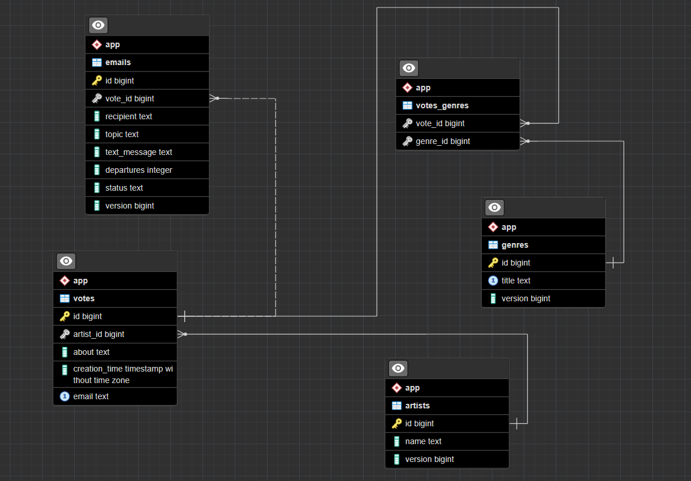

WebAppVoting
============

    The app is designed to vote for specific music artists/genres.

    The web application uses Java 11, Spring core, Spring MVC, Hibernate, PostgreSQL.

    The project is built using maven.
    
The application uses the following database schema:
--------------------------------------------------
    


Versions and other libraries used can be seen in
<a href="https://github.com/MaxStribuk/WebAppVoting/blob/master/pom.xml">pom.xml</a> file.

Usage
-----

You can clone the repository and use the application locally on your computer.<br>
I draw your attention to the mandatory filling in of the settings for connecting
to the database and the email sending service.<br>
The fields required for filling are in the
<a href="https://github.com/MaxStribuk/WebAppVoting/blob/master/src/main/resources/application_template.properties">
application_template.properties</a> file.<br>
Once filled, the file should be renamed to application.properties.<br>
The root repository contains a postgres folder containing ddl and dml files with sql code used in the application.<br>
You can use it to create tables and populate them with default data.<br>
Please note that ddl does not create the database itself, you will need to do it yourself.

You can use the version of the application available at the following link: [project link](http://localhost:8080/voting "in progress")
---------------------------------------------------------------------------

    All data in the application is given and received exclusively in JSON format.
    It is necessary to transfer data to the application in body requests.
    The application supports requests to the following URLs:

> /artists

When accessing the GET method, you can get a list of all artists.

for example: <a href="http://178.62.215.246:8080/voting/artists">get all artists</a>
`http://localhost:8080/voting/artists`

> /artists/{id}

You can get information about a specific artist by specifying the id as part of the URL using a GET request

for example: <a href="http://178.62.215.246:8080/voting/artists/1">get artist</a>
`http://localhost:8080/voting/artists/1`

> /artists

You can add your own artist by making a POST request.<br>
The body must contain the name of the artist, as shown in the example below:

for example: <a href="http://178.62.215.246:8080/voting/artists">add artist</a>
`http://localhost:8080/voting/artists`

body:
```json
{
  "name": "AC/DC"
}
```

> /artists/{id}/version/{version}

You can make a PUT request to change the name of an existing artist.<br>
The URL must include the id and version of the artist being changed.<br>
As part of the body, you must pass the new name of the artist.

for example: <a href="http://178.62.215.246:8080/voting/artists/4/version/0">update artist</a>
`http://localhost:8080/voting/artists/4/version/0`

body:
```json
{
  "name": "AC/DC"
}
```

> /artists/{id}/version/{version}

You can make a DELETE request to remove an existing artist.<br>
The URL must include the id and version of the artist to be removed.

for example: <a href="http://178.62.215.246:8080/voting/artists/4/version/0">delete artist</a>
`http://localhost:8080/voting/artists/4/version/0`

> /genres

When accessing the GET method, you can get a list of all genres.

for example: <a href="http://178.62.215.246:8080/voting/genres">get all genres</a>
`http://localhost:8080/voting/genres
`
> /genres/{id}

You can get information about a specific genre by specifying the id as part of the URL using a GET request

for example: <a href="http://178.62.215.246:8080/voting/genres/1">get genre</a>
`http://localhost:8080/voting/genres/1`

> /genres

You can add your own genre by making a POST request.<br>
The body must contain the name of the genre, as shown in the example below:

for example: <a href="http://178.62.215.246:8080/voting/genres">add genre</a>
`http://localhost:8080/voting/genres`

body:
```json
{
  "title": "Rock"
}
```

    Please note that duplication of genres is not allowed.

> /genres/{id}/version/{version}

You can make a PUT request to change the name of an existing genre.<br>
The URL must include the id and version of the genre being changed.<br>
As part of the body, you must pass the new name of the genre.

for example: <a href="http://178.62.215.246:8080/voting/genres/4/version/0">update genre</a>
`http://localhost:8080/voting/genres/4/version/0`

body:

```json
{
  "title": "Rock"
}
```

> /genres/{id}/version/{version}

You can make a DELETE request to remove an existing genre.<br>
The URL must include the id and version of the genre to be removed.

for example: <a href="http://178.62.215.246:8080/voting/genres/4/version/0">delete genre</a>
`http://localhost:8080/voting/genres/4/version/0`

> /vote

You can vote by making a POST request to the following URL:

for example: <a href="http://178.62.215.246:8080/voting/vote">add vote</a>
`http://localhost:8080/voting/vote`

body:

```json
{
  "artistId": 1,
  "genreIds": [
    1,
    2,
    3,
    4
  ],
  "about": "Hello, my name is Jack.",
  "email": "12345@gmail.com"
}
```

Be sure to pass data in the body of the request as shown below.<br>
You must select only 1 artist and strictly 3 to 5 genres.<br>
In addition, you must provide some information about yourself.<br>
For each email it is possible to vote only 1 time.<br>
After voting, information about how you voted will be sent to the email address you specified.

> /results

To get current voting results, you can make a GET request to the following URL:

for example: <a href="http://178.62.215.246:8080/voting/results">get results</a>
`http://localhost:8080/voting/results`

    The results will be sorted by the number of votes.